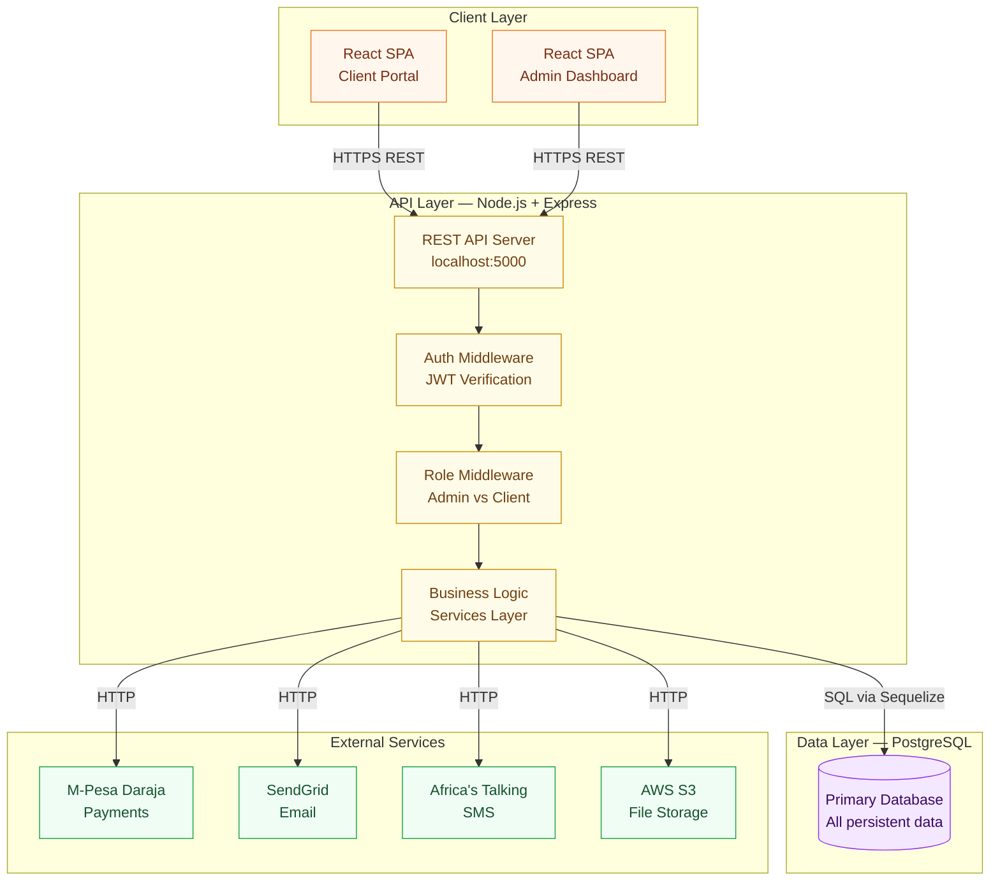
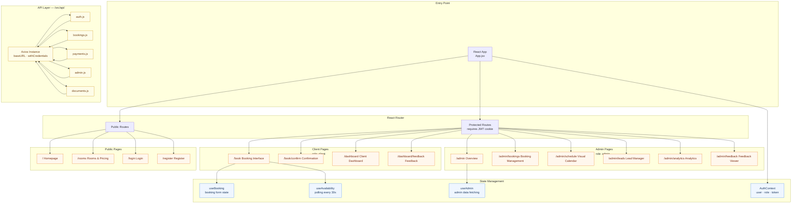
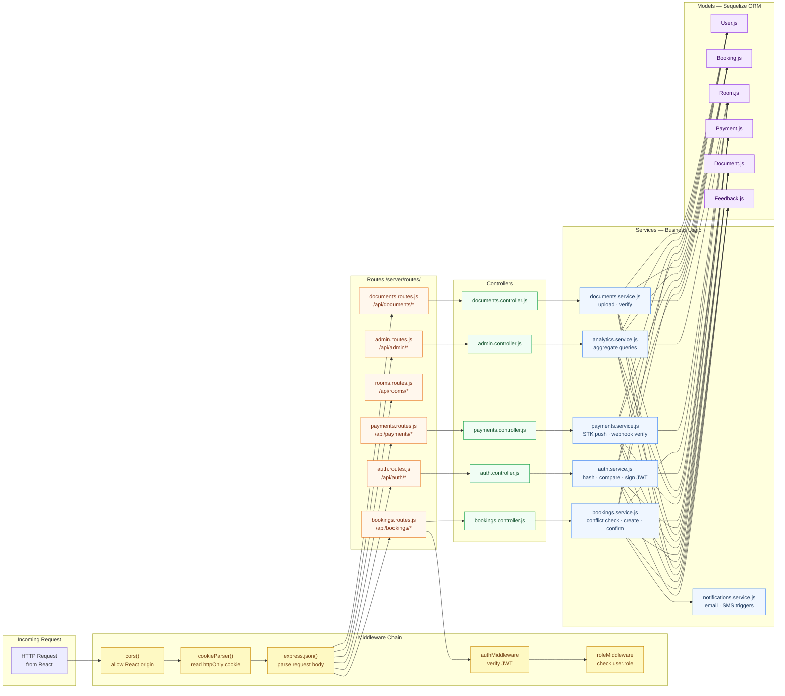
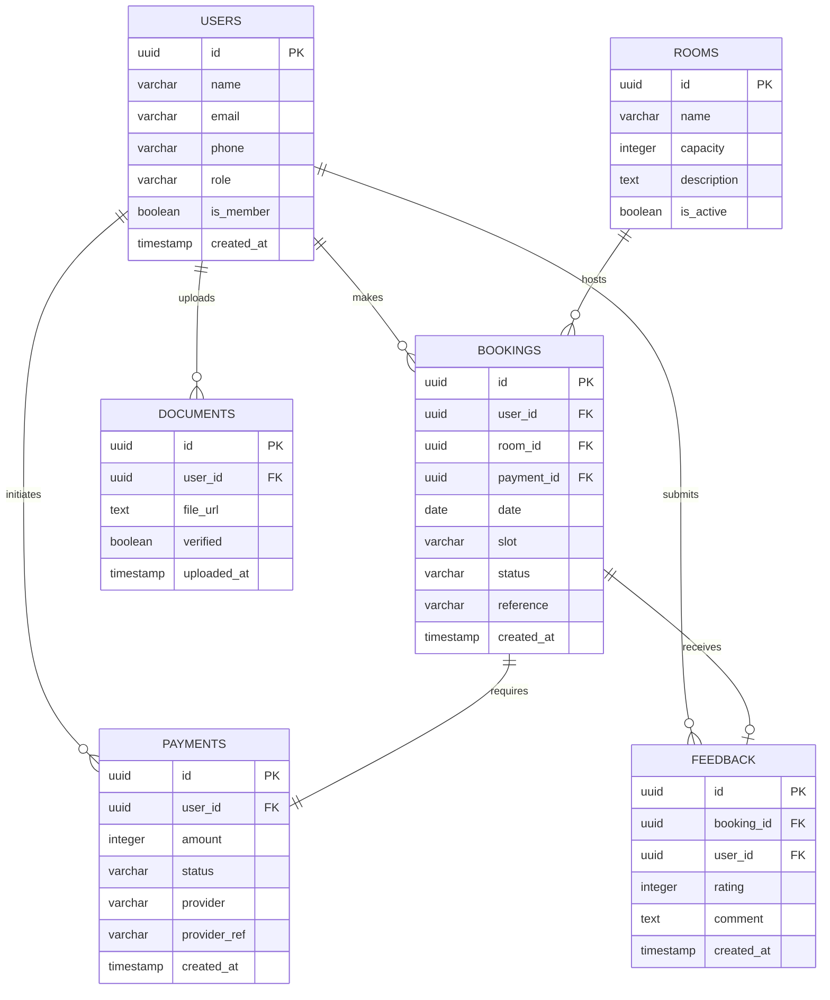
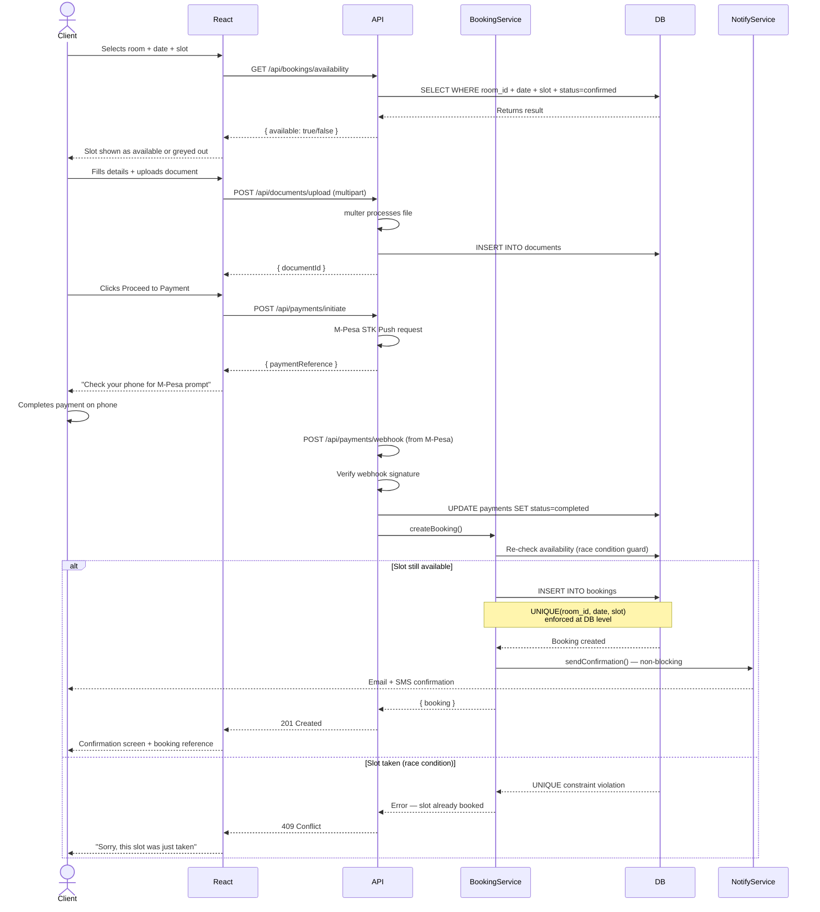
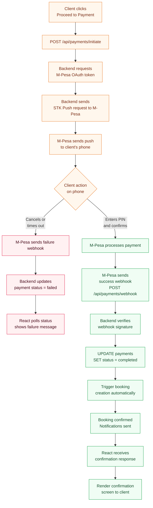
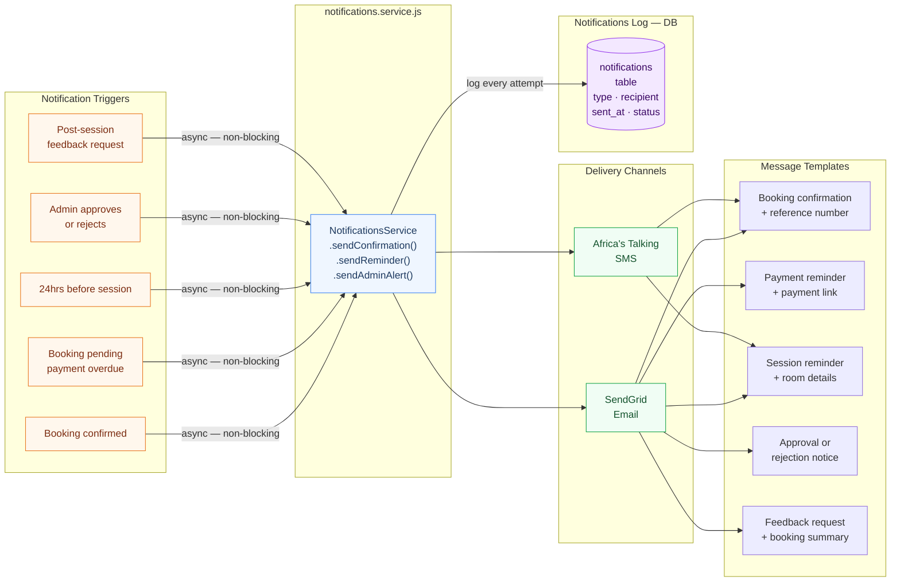
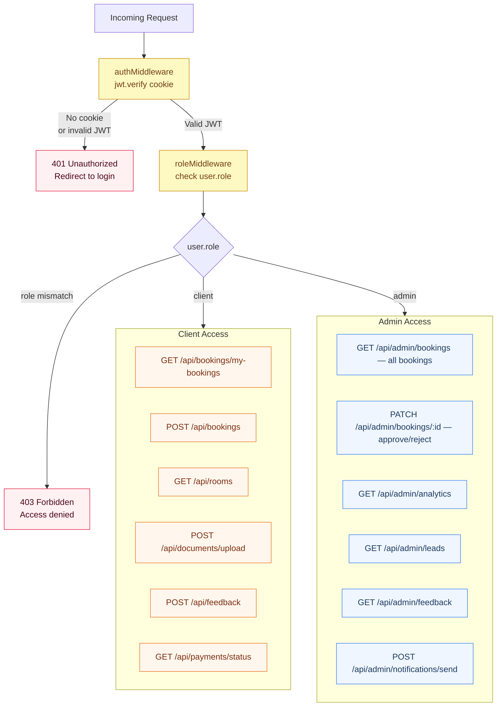
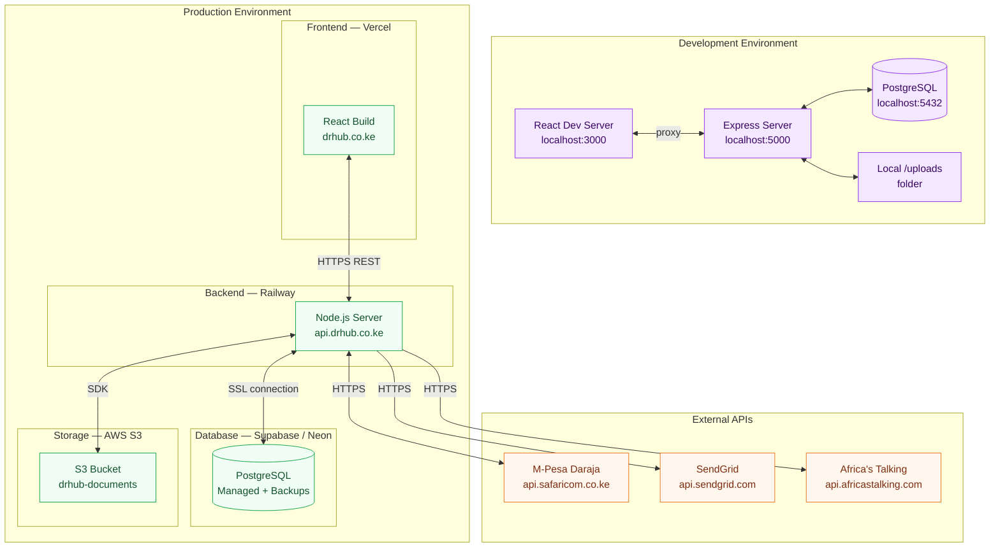

# DR Hub — System Architecture

> This document covers the full technical architecture of the DR Hub
> Office Hire System.

---

## Table of Contents

1. [High-Level Overview](#1-high-level-overview)
2. [Frontend Architecture](#2-frontend-architecture)
3. [Backend Architecture](#3-backend-architecture)
4. [Database Schema](#4-database-schema)
5. [Authentication Flow](#5-authentication-flow)
6. [Core Booking Flow](#6-core-booking-flow)
7. [Payment Flow](#7-payment-flow)
8. [Notification Flow](#8-notification-flow)
9. [Role-Based Access Control](#9-role-based-access-control)
10. [Deployment Architecture](#10-deployment-architecture)

---

## 1. High-Level Overview

The system is divided into four layers. No layer skips another —
the frontend never talks directly to the database.


---

## 2. Frontend Architecture

The frontend is a React 18 Single Page Application. All navigation
is client-side. The app is split into two portals sharing a single
codebase, separated by role.


---

## 3. Backend Architecture

Every request flows through the same chain:
**Route → Middleware → Controller → Service → Database**.
No layer is skipped. No business logic lives in routes.


---

## 4. Database Schema

Six tables with clear foreign key relationships.
The `UNIQUE(room_id, date, slot)` constraint on the bookings
table is the database-level guarantee against double bookings.


---

## 5. Authentication Flow

JWT is stored in an `httpOnly` cookie — never in localStorage.
This prevents XSS attacks from stealing the token.
```mermaid
sequenceDiagram
    actor User
    participant React
    participant API
    participant DB

    User->>React: Enters email + password
    React->>API: POST /api/auth/login
    API->>DB: SELECT * FROM users WHERE email = ?
    DB-->>API: Returns user record
    API->>API: bcrypt.compare(password, hash)

    alt Password valid
        API->>API: jwt.sign({id, role}, JWT_SECRET)
        API-->>React: 200 OK + Set-Cookie: token=JWT; httpOnly
        React->>React: Store user in AuthContext
        React-->>User: Redirect to dashboard
    else Password invalid
        API-->>React: 401 Unauthorized
        React-->>User: Show error message
    end

    Note over React,API: Every subsequent request sends<br/>cookie automatically via withCredentials:true

    React->>API: GET /api/bookings (cookie sent automatically)
    API->>API: authMiddleware — jwt.verify(cookie.token)
    API->>API: roleMiddleware — check user.role

    alt Valid token + correct role
        API-->>React: 200 OK + requested data
    else Invalid token
        API-->>React: 401 — redirect to login
    else Wrong role
        API-->>React: 403 — access denied
    end
```

---

## 6. Core Booking Flow

This is the most critical flow in the system.
Note that availability is checked TWICE — once optimistically
in the UI, and again inside the service before the database write.


---

## 7. Payment Flow

Payment confirmation comes from M-Pesa's webhook — not from
the client. This is the correct and secure approach. Never trust
a client-side payment callback.


---

## 8. Notification Flow

Notifications are always fired asynchronously — a failed
email or SMS must never cause a booking to fail.


---

## 9. Role-Based Access Control

Two roles exist in the system: `client` and `admin`.
Every protected route passes through both middleware layers.


---

## 10. Deployment Architecture


---

## Key Architecture Decisions

| Decision | Choice | Reason |
|---|---|---|
| SPA framework | React 18 | Component reuse across client and admin portals |
| API style | REST | Simple, well-understood, easy to test |
| Auth storage | httpOnly cookie | Prevents XSS token theft vs localStorage |
| ORM | Sequelize | Migration support + model validation |
| Double-booking guard | DB UNIQUE constraint + service check | Two layers — service catches it cleanly, DB is the final guarantee |
| Payment confirmation | M-Pesa webhook | Never trust client-side callbacks for payment status |
| Notifications | Async non-blocking | A failed email must never fail a booking |
| Real-time availability | 30s polling (demo) → WebSockets (production) | Polling sufficient for demo; WebSockets added post-launch |

---

*Last updated: April 2026 — DR Hub Engineering Team*